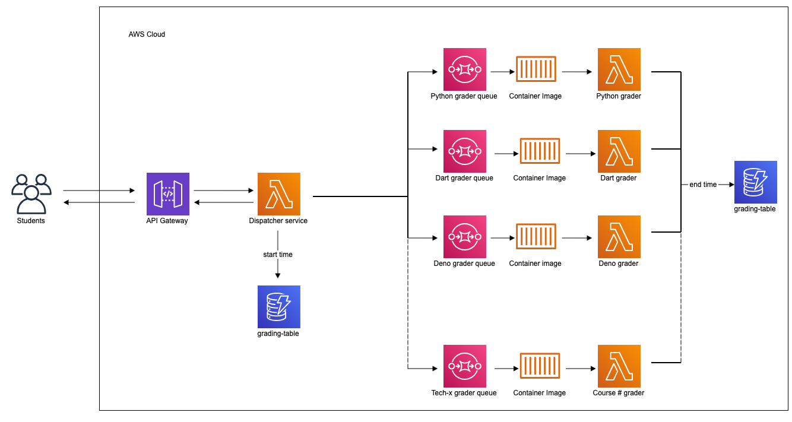
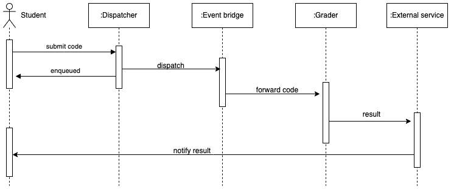
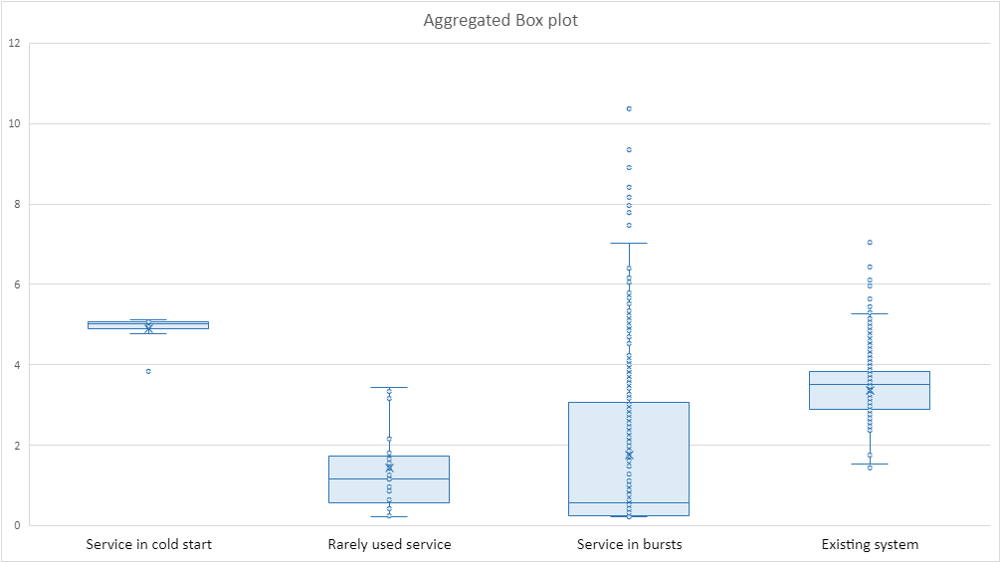

# Automated Grader

This project is part of Master's thesis work titled [Serverless Automated Assessment of Programming Assignments](https://aaltodoc.aalto.fi/handle/123456789/122890). It is a serverless redesign solution of existing automated grader used in Aalto University. The existing sample grader image will be to run the unit tests. The main bottleneck in the existing system happens when running the grader images in the time of deadlines; the existing service doesn’t scale up to meet the high traffic concurrent grading request demands. For this reason, the serverless redesign solution will be applied to the grading service by utilizing [Lambda container images](https://docs.aws.amazon.com/lambda/latest/dg/images-create.html).

A microservice architecture with cloud native approach for the serverless solution is presented. It utilizes managed cloud services provided by AWS.

## Implementation

The sequence diagram below illustrates the details of implementation more clearly. It shows the flow of messages and interactions between different components within a system. The action is triggered by student when submitting a source code to the grader service. Then the dispatcher service passes the submitted code to proper grader service.

> [!NOTE]
> The project uses `aws-nodejs-typescript` template. The service can be deployed to AWS and tested. Instruction to perform this action can be found [here](./docs/runbook.MD)

## Load testing

k6 testing tool is used to perform load testing on this service. It is possible to simulate high levels of traffic from multiple sources. k6 provides built-in features for coordinating and synchronizing the VUs, ensuring that they work together to simulate a cohesive and realistic load.

For detailed instructions, please refer to the [k6 documentation](https://k6.io/docs/)

Three different scenarios are considered to execute the load test. Doing this will assist to capture most frequent or probable situations. It enables to anticipate how the system handles such scenarios. As a result, it will provide realistic estimation of AWS bill, time and resource consumption. Refer to _Chapter 5 - Evaluation_ of the thesis work to get more specific guidelines on how to run the tests.

## Results

For the purpose of the research work, the tests run with three different scenarios. The box-plot diagram below shows aggregated values for request duration  which are computed from each experiment scenario and existing system logs. Also _Chapter 6 - Evaluation results_ of the thesis work to get proper interpretation of the experiment results. 

